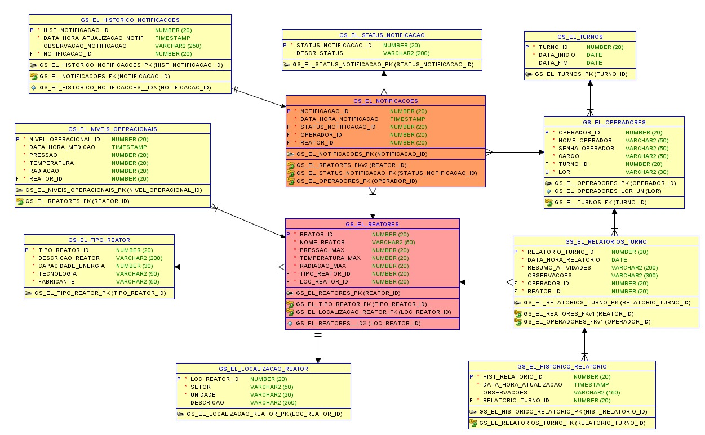

# Sistema de Monitoramento e Emissão de Alertas para Operadores de Usinas Nucleares

## Descrição Geral do Projeto

O **Sistema de Monitoramento e Emissão de Alertas** foi desenvolvido para operadores de usinas nucleares, com o objetivo de garantir a segurança e o monitoramento constante das condições operacionais da usina. Este sistema envolve a coleta de dados em tempo real, como temperatura, pressão, radiação, e fluxo de refrigeração, com emissão de alertas para condições adversas e críticas. 

Além disso, o sistema conta com um módulo de **verificação do uso de EPIs (Equipamentos de Proteção Individual)** pelos operadores, utilizando tecnologias de deep learning e visão computacional.

## Funcionalidades

- **Aplicação Móvel**:
    - Login e Cadastro do Operador
    - Monitoramento de Temperatura, Pressão, Fluxo de Refrigeração e Níveis de Radiação
    - Status Geral (Normal, Alerta, Crítico)
    - Integração com o Sistema Backend (Java) e Banco de Dados Oracle

- **Aplicação .NET (Relatório Diário)**:
    - Login e Cadastro do Operador
    - Tela de Relatório Diário de Trabalho
    - Integração com Banco de Dados Oracle para armazenar os dados do relatório

- **Deep Learning & Visão Computacional**:
    - Reconhecimento de EPIs, como máscara, óculos, e macacão, garantindo que os operadores estejam utilizando o equipamento adequado.

## Tecnologias Utilizadas

- **Backend**: Java, Spring Boot, Oracle Database, Docker
- **Frontend/Mobile**: Kotlin, Figma,
- **Deep Learning & Visão Computacional**: Python, TensorFlow/Keras, OpenCV
- **Relatório Diário**: .NET Core, Entity Framework, Oracle Database

## Modelagem do Banco de Dados


## Backend com Java Spring Boot
O **EnergyX Backend** é uma aplicação backend desenvolvida em **Java** que integra funcionalidades de monitoramento de condições adversas em usinas nucleares, com foco em garantir a segurança através, sobretudo, da gestão de processos. A aplicação utiliza a tecnologia **Spring Boot** para fornecer uma API RESTful que interage com o banco de dados **Oracle** e comunica-se com a aplicação mobile para exibir informações sobre as condições da usina e operadores.

## Clonagem do repositório

Comando para clonar o repositório e abrir o projeto na IDE desejada:
   ```bash
   git clone https://github.com/sousa-sara/energyx-backend.git
   cd energyx
  ```

## Como Rodar a Aplicação EnergyX no Docker

Para rodar a aplicação EnergyX no Docker, siga os passos abaixo:

### 1. **Pré-requisitos**
Certifique-se de que você tem as seguintes ferramentas instaladas:

- **Docker**: [Instruções de instalação do Docker](https://docs.docker.com/get-docker/)
- **Maven/Gradle** (se não tiver o arquivo JAR gerado previamente)

### 2. **Construir o JAR da Aplicação**
Primeiro, você precisa garantir que o arquivo JAR da aplicação esteja pronto para ser utilizado. Se você ainda não gerou o arquivo JAR, siga estas instruções:

#### Usando Maven:
No diretório raiz do seu projeto, execute o comando para construir o JAR:

```bash
mvn clean install
```

Esse comando vai gerar o arquivo energyx-0.0.1-SNAPSHOT.jar dentro da pasta target/.


### 3. Construir a Imagem Docker
Agora, é preciso criar a imagem Docker a partir do Dockerfile fornecido no projeto Java.

No diretório raiz do projeto, onde o Dockerfile está localizado, execute o seguinte comando:

```bash
docker build -t energyx-backend-image .
```

Esse comando irá construir a imagem Docker e nomeá-la como energyx-backend-image.

### 4. Rodar a Aplicação no Docker
Após a construção da imagem Docker, você pode rodar a aplicação dentro de um container Docker. Para isso, execute o seguinte comando:

```bash
docker run -p 8080:8080 --name energyx-backend energyx-backend-image
```

O comando acima vai mapear a porta 8080 do container para a porta 8080 da sua máquina local, permitindo o acesso à aplicação.

### 5. Acessar a Aplicação
A aplicação agora está rodando dentro do container. Abra o navegador e acesse a seguinte URL:

```bash
http://localhost:8080
```

- Com Swagger:
```bash
http://localhost:8080/swagger-ui/index.html#/
```

## Apresentação em Vídeo do Projeto

Link do Pitch:

Link Aplicação Java Spring Boot:

## Sobre o Projeto Global Solutions
A cada semestre, desenvolvemos um projeto que integra todas as disciplinas do curso de Análise e Desenvolvimento de Sistemas, com o objetivo de propor soluções para um tema de relevância global, promovido pela nossa instituição.

**Global Solutions - Tema:** Energia Renovável

Este projeto aborda soluções inovadoras e sustentáveis para questões relacionadas à energia renovável, buscando promover um impacto positivo na sociedade e no meio ambiente.

**Instituição:** FIAP - Faculdade de Informática e Administração Paulista

**Turma:** 2TDSPS

## Desenvolvedores

[Felipe Amador](https://github.com/felipetosma) | RM 553528

[Leonardo Oliveira](https://github.com/leooli-321) | RM 554024

[Sara Sousa](https://github.com/sousa-sara) | RM 552656
